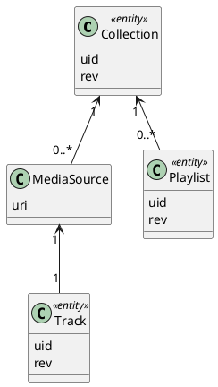
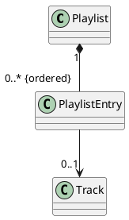

# aoide


[](https://gitlab.com/uklotzde/aoide-rs/pipelines?scope=branches)
[](https://github.com/aoide-org/aoide-rs/actions?query=workflow%3A%22Continuous+integration%22)
[](https://gitlab.com/uklotzde/aoide-rs/blob/main/LICENSE.md)

A local HTTP/REST service for managing and exploring music collections. Independent and portable. Written in Rust.

## Fundamentals

### Overview

A music _collection_ is an aggregation of both _tracks_ (aka songs) and _playlists_:



_Media sources_ are the glue objects between _tracks_ and their _collection_. The URI of a _media source_ is unique within a collection.

The top-level entities _collection_, _track_, and _playlist_ are identified by a _**u**nique **id**entifier_ or short _uid_. This identifier is generated and guaranteed to be globally unique. Modifications are tracked by a revision number _rev_.

### Playlists

Traditionally music collections are organized into subsets of tracks, namely
_playlists_ (ordered) or _crates_ (unordered). Both playlists and crates are
_static_, i.e. the tracks are assigned to them independent of their metadata.
Modifying the metadata will not change the membership to playlists and crates.

Playlists are an ordered collection of _entries_. Most entries reference a track.
Entries without a track reference act as separators to partition the playlist
into sections. All tracks in a playlist must be contained in the same collection.



Unordered crates are currently not supported.

### Tracks

Tracks and their media sources are characterized by metadata like _artist_
, _title_, or _duration_. This metadata is stored in the database.

Some or all of this metadata might have been imported from the media source's URI,
e.g. from an _MP3_ file with _ID3v2_ tags or an _MP4_ container with _atoms_.
If the media source is not stored locally but provided by a streaming service
then this metadata might have been obtained separately by API calls.

### Tags

Track metadata is usually restricted to predefined properties that are not
extensible. Aoide allows assigning custom metadata through _tags_.

Only a basic set of track properties is predefined, everything else can be
covered by tags. Even the common property _genre_ is encoded as a tag
and allows one to assign multiple values. We will revisit this example in
a moment.

#### Plain tags

The public value of a tag is stored in the _label_. Each tag may be
assigned a _score_ between 1.0 (= maximum/default) and 0.0 (= minimum).
Tags with only a _label_ and _score_ are called _plain tags_.

#### Faceted tags

_Faceted tags_ allow storing multiple, different _labels_ for the same
_facet_. Tags with the same facet can be prioritized among each other by
assigning a _score_ like for _plain tags_.

A typical use case for multi-valued, faceted tags is the _musical genre_.
The musical genre of a track is manifold and ambiguous with a varying
degree of association. It is (by convention) represented by the facet
"genre". The different labels might contain values like "Pop", "Rock",
"R&B/Soul", "Hip-Hop/Rap", ... each with a _score_ that represents the
perceived relationship to this genre. Ordering the tag labels by their
descending score value reveals the main genre(s).

Faceted tags and their score could also be used to store feature analysis
results of the audio data like energy, valence, or danceability for
encoding a huge amount of musical knowledge about the collected tracks
and to perform clustering on this data.

### Queries

Powerful queries with filtering and sorting criteria can be defined by clients
and executed on the database. The criteria of those queries can refer to both
predefined textual or numerical properties as well as all custom tags with their
facet, label, and score.

Some applications allow defining _dynamic_ playlists or crates. In this
case, the membership is defined by a _selection criteria_. Their internal
ordering (in case of playlists) is defined by a _sort criteria_. In aoide
queries are used for this purpose.

## Build & run

[build & run]: #build-and-run

### Executable

The server executable is built with the following command:

```bash
cargo build --all-features --package aoide-websrv
```

> Use `cargo build --release ...` for an optimized release build instead of a debug build!

During development it is handy to build and run the executable in a single step:

```bash
cargo run --all-features --package aoide-websrv
```

The configuration is controlled by environment variables. Please refer to the
file [.env](.env) in the project folder for an example configuration.

#### Configuration examples

| Configuration                    | Description                                             |
| -------------------------------- | ------------------------------------------------------- |
| `RUST_LOG=debug`                 | Log/tracing level `debug` (trace/debug/info/warn/error) |
| `ENDPOINT_IP=::`                 | Listen on IPv6 loopback device                          |
| `ENDPOINT_PORT=0`                | Bind to an ephemeral port for incoming HTTP requests    |
| `ENDPOINT_PORT=8080`             | Bind to port 8080 for incoming HTTP requests            |
| `DATABASE_URL=:memory:`          | Use an in-memory database for testing purposes          |
| `DATABASE_URL=/tmp/aoide.sqlite` | Open or create the corresponding SQLite database file   |

The actual socket address with the bound (ephemeral) port will be printed on the first line to _stdout_
where the client can pick it up for connecting. You may also bind the service to some predefined port.

Log/tracing messages are formatted as JSON and printed to _stderr_.

### Tests

Build and run the unit tests with the following command:

```bash
cargo test --workspace --all-features --verbose -- --nocapture
```

## Deploy

### Native

Follow the instructions in [Build & run](#build-and-run) for building a dynamically
linked executable for the host system.

### Docker

#### Docker build

```sh
docker build -t aoide:latest .
```

The final image is created `FROM scratch` and does not provide any user environment or shell.
It contains just the statically linked executable that can be extracted with `docker cp`.

#### Docker run

The container exposes the internal port 8080 for publishing to the host. The volume that
hosts the SQLite database is mounted at /data.

Example:

```sh
docker run --rm \
    -e RUST_LOG=info \
    -e DATABASE_URL=aoide.sqlite \
    -p 7878:8080 \
    -v .:/data:Z \
    aoide:latest
```

This will start the instance with the database file _aoide.sqlite_ in the current working directory.

## REST API

Once started the server will respond with a static HTML page when sending a GET request
to the root path _/_ or _/index.html_. This page contains a link to the embedded
[OpenAPI](https://www.openapis.org) specification implemented by the service.

Use the [Swagger Editor](https://editor.swagger.io) for exploring the API specification.

## Licensing

License: AGPL-3.0-or-later

This program is free software: you can redistribute it and/or modify
it under the terms of the GNU Affero General Public License as
published by the Free Software Foundation, either version 3 of the
License, or (at your option) any later version.

This program is distributed in the hope that it will be useful,
but WITHOUT ANY WARRANTY; without even the implied warranty of
MERCHANTABILITY or FITNESS FOR A PARTICULAR PURPOSE. See the
GNU Affero General Public License for more details.

You should have received a copy of the GNU Affero General Public License
along with this program. If not, see <https://www.gnu.org/licenses/>.

---

## One more thing...

_Ἀοιδή_ - the muse of voice and song in Greek mythology.

> There are only two hard things in Computer Science: cache invalidation and naming things.
>
> -- Phil Karlton

See also: [TwoHardThings](https://martinfowler.com/bliki/TwoHardThings.html)
